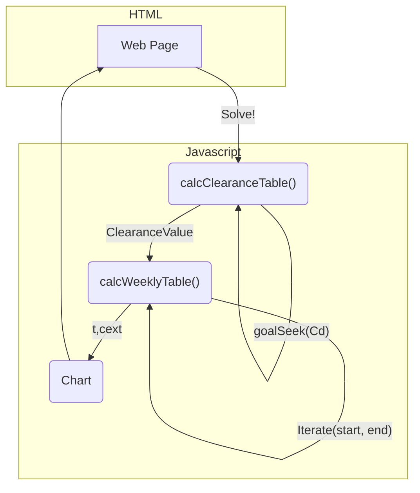

https://webclear.netlify.app

# Dialysis Simulator

`calcClearanceTable()` - The `goalseek()` function iterates to find a starting Cd value minimized to 0 by the end of the dialyzer, or as x reaches 1.000. The inputs from the website run through a table that uses pseudo-calculus to model the values of several variables through the dialyzer. With an initial Cd value that reaches 0, other important values dependent on it can be used in the calculation of the clearance. Protein binding percentage is assumed to be 0%, albumin concentration is assumed to be 500 µM, and ∆P0 and ∆P1 are assumed to be 40 torr.

`calcWeeklyTable()` - Using the clearance value derived from the `calcClearanceTable()` calculations, the table calculates the concentration of urea. The iteratation loop searches for an initial urea concentration that roughly matches the ending concentration by continually bisecting the difference between the initial guess and the resulting final concentration. 

The inputs from the Web Page are collected in the Javascript code, which triggers with a press of the `Solve!` button or a change in one of the inputs. Both the calcClearanceTable() and calcWeeklyTable() functions construct a table to hold and report the computations, creating the final table, Weeklytable. From this, the Chart data is populated, then rendered via HTML element canvas.

The `Hold` mode allows for the graphing of multiple concentrations vs time scenarios.  Under this mode, the inputs are ignored until the `Solve!` button is pressed, and new graph is rendered, overlaying the existing set of scenario(s).  When the hold mode is disabled, all scenarios are cleared, leaving behind a graph from the most recent set of inputs.

Created with CodeSandbox
