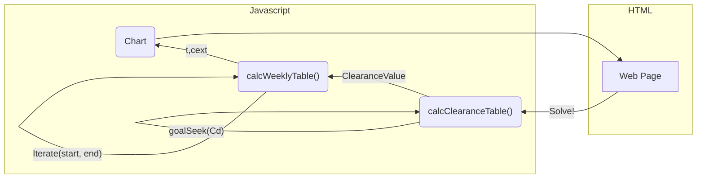

https://webclear.netlify.app

# Dialysis Simulator

```mermaid

graph RL
    subgraph HTML
       A 
    end
    subgraph Javascript
        D -- "Iterate(start, end)" -->D
        D --  t,cext --> E(Chart)
        E --> A
        B -- "goalSeek(Cd)" --> B
        A[Web Page] -- Solve! --> B("calcClearanceTable()")
        B -- ClearanceValue --> D("calcWeeklyTable()")
    end

```

Created with CodeSandbox
