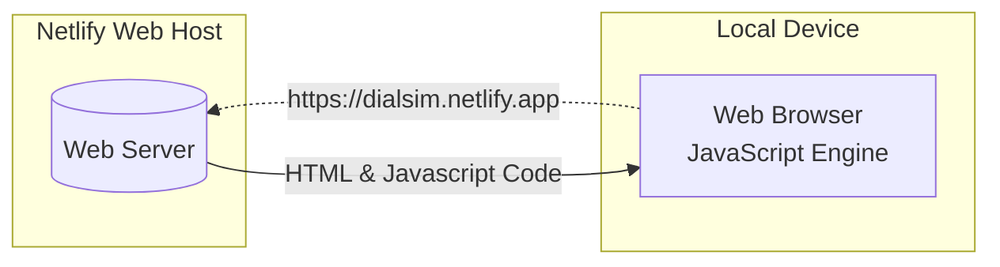
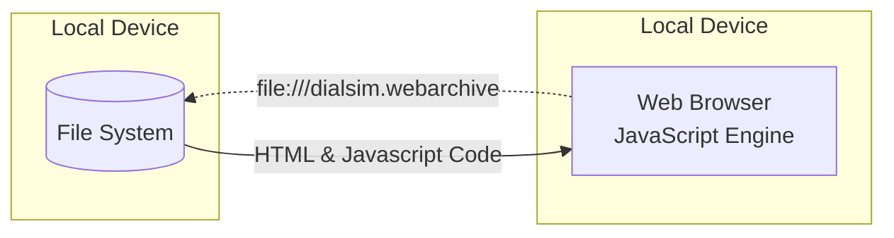
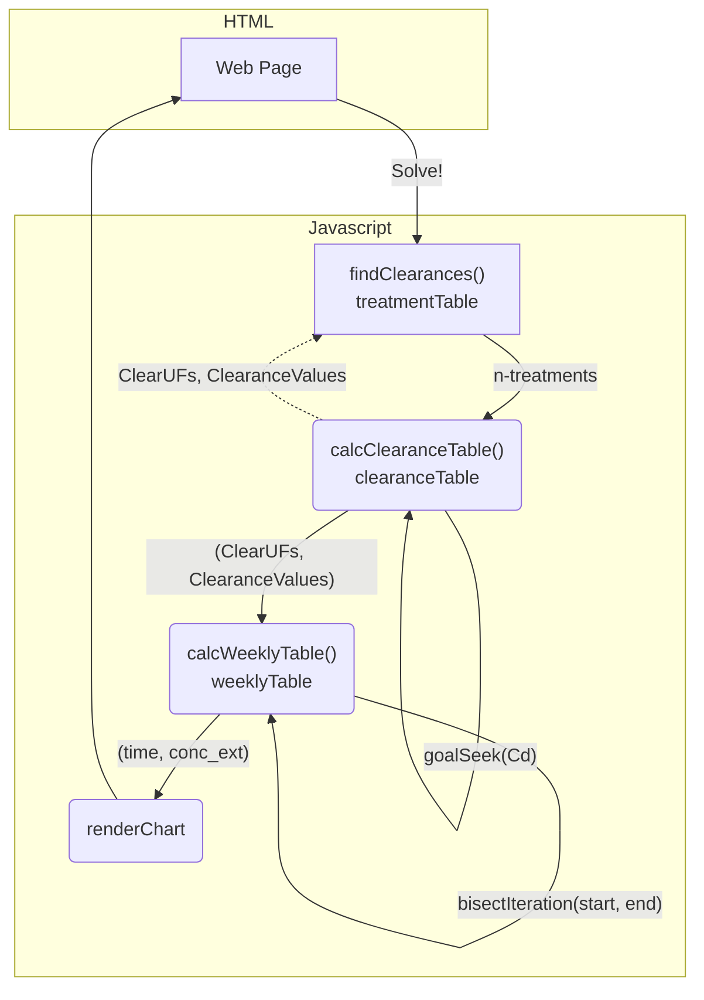

  &nbsp;&nbsp;   &nbsp;&nbsp;    &nbsp;&nbsp; 

https://dialsim.netlify.app

https://dialsim.com

# Dialysis Simulator: A Web Application

## How this program works on your local device

The Dialysis Simulator is a responsive, single-page web application compatible with any device that has a web browser. You can host its code (comprising of HTML, CSS, and JavaScript) on a traditional web server or even on a local storage file system.

Once you've loaded the application via its [URL](https://dialsim.netlify.app) or through the [Webarchive](https://en.wikipedia.org/wiki/Webarchive) file, it can operate untethered without needing an active internet connection.

Browsers are more than just gateways to the internet; they seamlessly integrate HTML, CSS, and JavaScript to display web content. As users engage with the page—whether it's clicking buttons, typing, or scrolling—JavaScript takes charge. It processes these interactions, offering real-time feedback, calculations, and chart visualizations.

## Untethered operation

## JavaScript Architecture

The inputs from the Web Page are collected in the Javascript code, which triggers with a press of the `Solve!` button or a change in one of the inputs. Both the `calcClearanceTable()` and `calcWeeklyTable()` functions construct a table to hold and report the computations, creating the final table, `weeklyTable`. From this, the Chart data is populated, then rendered via HTML element canvas.

`calcClearanceTable()` - The `goalseek()` function iterates to find a starting `Cd` value minimized to 0 by the end of the dialyzer, or as variable `x` reaches 1.000. The inputs from the website run through a table that uses pseudo-calculus to model the values of several variables through the dialyzer. With an initial `Cd` value that reaches 0, other important values dependent on it can be used in the calculation of the clearance. Protein binding percentage is assumed to be 0%, albumin concentration is assumed to be 500 µM, and ∆P0 and ∆P1 are assumed to be 40 torr.

`calcWeeklyTable()` - Using the clearance value(s) derived from the `calcClearanceTable()` calculations, the table calculates the concentration of urea. The iteratation loop searches for an initial urea concentration that roughly matches the ending concentration by continually bisecting the difference between the initial guess and the resulting final concentration.

## Hold mode

The `Hold` mode allows for the graphing of multiple concentrations vs time scenarios. Under this mode, the inputs are ignored until the `Solve!` button is pressed, and new graph is rendered, overlaying the existing set of scenario(s). When the hold mode is disabled, all scenarios are cleared, leaving behind a graph from the most recent set of inputs.

