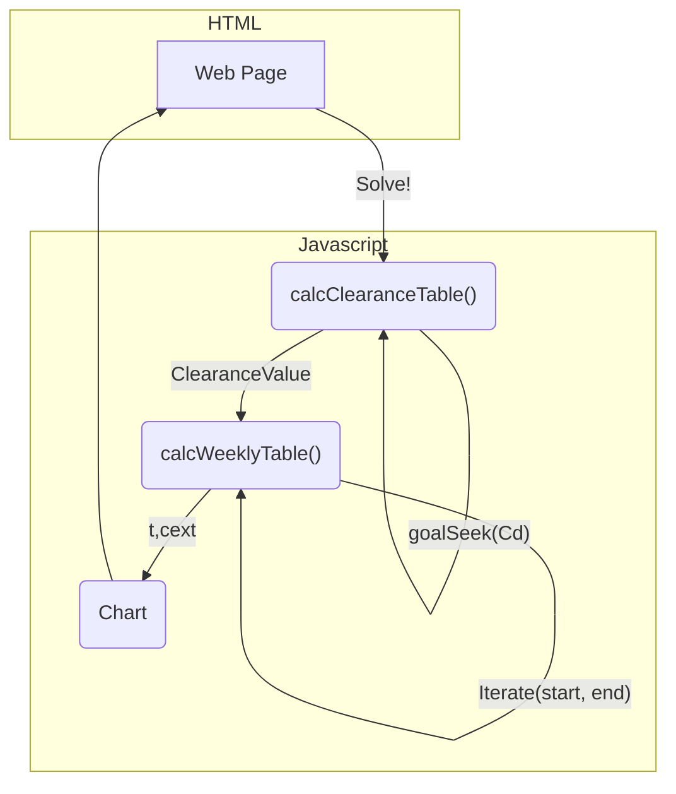

https://webclear.netlify.app

# Dialysis Simulator

`calcClearanceTable()` - goalseek function iterates to find a starting Cd value that approaches 0 as x (the position in the dialyzer) approaches 1. The inputs from the website run through a table that uses pseudo-calculus to model the values of several variables through the dialyzer. With an initial Cd value that reaches 0, the final Qp, theta, and Cp values are used, along with other constants, to find the clearance.
Protein binding percentage is assumed to be 0%, albumin concenrtation is assumed to be 500 µM, and ∆P0 and ∆P1 are assumed to be 40 torr

`calcWeeklyTable()` - Using the clearance value derived from the calcClearanceTable calculations, the Iterate loop searches for an initial urea concentration that roughly matches the ending concentration by continually bisecting the difference between the initial guess and the resulting final concentration.

Created with CodeSandbox
